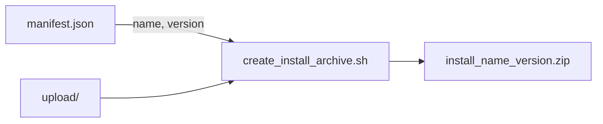

# Шаблон плагина DevCraft / DLE

Стартовый шаблон для плагинов DevCraft (DataLife Engine). Включает структуру проекта, скрипты сборки, конфигурацию Crowdin, шаблоны GitHub Issues и CI (Woodpecker / GitHub Actions).

## Структура каталогов

```
manifest.json                  # Метаданные плагина (версия, имя, совместимость)
upload/                        # Файлы плагина для установки в DLE
  .gitkeep                     # Заглушка для Git (не попадает в архив при сборке)
  devcraft/
    locales/
      ru_RU/
        devcraft.xliff           # Исходный файл Crowdin (пример — замените!)
create_install_archive.sh      # Сборка: upload/ → install_{name}_{version}.zip (Linux/macOS)
create_install_archive.bat     # Сборка: upload/ → install_{name}_{version}.zip (Windows)
create_install_archive.ps1     # Вспомогательный скрипт для Windows (имя архива)
crowdin.yml                    # Настройка переводов Crowdin
.woodpecker.yml                # CI-пайплайн (Woodpecker / git.hrdr.dev)
.github/workflows/build.yml    # CI-пайплайн (GitHub Actions / github.com)
```

## Создание нового репозитория

1. Создайте новый репозиторий из этого шаблона на [git.hrdr.dev](https://git.hrdr.dev).
2. Настройте [`manifest.json`](manifest.json) (имя, версия, совместимость).
3. Разместите код плагина в каталоге `upload/` (структура установки DLE).
4. Настройте `crowdin.yml` и файл переводов (см. ниже).
5. Активируйте CI: Woodpecker на [woodp.hrdr.dev](https://woodp.hrdr.dev) и/или GitHub Actions (см. ниже).
6. Замените название репозитория в [renovate.yml](./.woodpecker/renovate.yml) для обновления зависимостей, если такие есть. Иначе удалить этот файл

## manifest.json

Файл [`manifest.json`](manifest.json) в корне репозитория содержит метаданные плагина. Он используется при сборке для формирования имени архива и **не** копируется в ZIP.

### Поля

| Поле | Назначение |
|------|------------|
| `version` | Версия плагина — используется в имени архива |
| `name` | Название плагина — транслитерируется и преобразуется в slug для имени архива |
| `dle_version` | Поддерживаемая версия DLE (метаданные, не влияет на имя архива) |
| `admin_version` | Версия админки / API плагина (метаданные, не влияет на имя архива) |

### Пример

```json
{
  "version": "1.0.0",
  "name": "Мой Плагин",
  "dle_version": "20.1",
  "admin_version": "1.0.0"
}
```

### Имя архива

```
install_{name_translited_underlined}_{version}.zip
```

Примеры:

- `name: "devcraft"`, `version: "1.0.0"` → `install_devcraft_1.0.0.zip`
- `name: "Мой Плагин"`, `version: "1.2.0"` → `install_moy_plagin_1.2.0.zip`

### Правила формирования имени

- Кириллица транслитерируется в латиницу
- Все символы приводятся к нижнему регистру
- Пробелы и спецсимволы заменяются на `_`
- Повторяющиеся `_` схлопываются, крайние `_` удаляются



## Crowdin (`crowdin.yml`)

Файл `devcraft.xliff` в шаблоне — **заглушка**. При создании нового плагина его нужно заменить на имя вашего плагина.

### Что изменить

1. Создайте исходный XLIFF-файл в `upload/devcraft/locales/ru_RU/` (или другой исходной локали).
2. Обновите путь `source` в `crowdin.yml`.

**Шаблон (в репозитории-шаблоне):**

```yaml
source: /upload/devcraft/locales/ru_RU/devcraft.xliff
```

**Пример после настройки:**

```yaml
source: /upload/devcraft/locales/ru_RU/my-plugin.xliff
```

Исходный файл должен существовать в репозитории до синхронизации с [Crowdin](https://crowdin.com). Шаблон `translation` менять не нужно — он автоматически подставит локаль и имя файла.

## Локальная сборка

```bash
chmod +x create_install_archive.sh
./create_install_archive.sh
```

Результат: `install_{name}_{version}.zip` в корне репозитория (игнорируется Git). Скрипт выводит имя созданного файла в stdout.

Файлы `.gitkeep` — заглушки для пустых каталогов в Git. При сборке они автоматически удаляются из `temp/` и **не** попадают в архив.

В Windows:

```bat
create_install_archive.bat
```

## Woodpecker CI (`.woodpecker.yml`)

CI на [woodp.hrdr.dev](https://woodp.hrdr.dev) собирает архив после успешного merge pull request в ветку `main`.

Файл `.woodpecker.yml` в корне репозитория описывает пайплайн:

- **Триггер:** push в ветку `main` после успешного merge pull request
- **Шаг `build`:** запуск `create_install_archive.sh` (читает `manifest.json`)
- **Артефакт:** `install_*.zip` (имя зависит от `name` и `version` в manifest)

### Runner на git.hrdr.dev

Пайплайн настроен на глобальный runner со следующими параметрами:

| Параметр | Значение |
|----------|----------|
| Тип | Global |
| Labels | `homeserver`, `debian-13` |
| Статус | Активирован |

Блок `labels` в `.woodpecker.yml` направляет сборку на этот runner, а не на произвольный агент. Если значения labels в Woodpecker UI отличаются, скопируйте их из раздела **Runners → Labels** и обновите файл.

### Активация репозитория

1. Войдите на [woodp.hrdr.dev](https://woodp.hrdr.dev) через Gitea OAuth.
2. Выберите репозиторий из списка и активируйте его.
3. После следующего push пайплайн запустится автоматически.

### Скачивание артефакта

После успешной сборки архив вида `install_{name}_{version}.zip` появится в интерфейсе Woodpecker в разделе **Artifacts** соответствующего запуска пайплайна.

## GitHub Actions (альтернатива)

Для репозиториев на **GitHub** (зеркало или основной remote) используйте [`.github/workflows/build.yml`](.github/workflows/build.yml).

- **Триггер:** закрытие pull request с успешным merge в ветку `main`
- **Runner:** self-hosted с label `debian-13-sh`
- **Логика:** та же, что в Woodpecker — `create_install_archive.sh` читает `manifest.json` → `install_{name}_{version}.zip`
- **Артефакт:** скачивается в GitHub Actions UI (раздел **Artifacts** запуска workflow)

### Runner на GitHub

Workflow настроен на self-hosted runner со следующими параметрами:

| Параметр | Значение |
|----------|----------|
| Тип | Self-hosted |
| Label | `debian-13-sh` |

Значение `runs-on` в `.github/workflows/build.yml`:

```yaml
runs-on: [self-hosted, debian-13-sh]
```

Если label runner'а отличается, обновите его в workflow-файле.

| Платформа | CI-файл | Runner | Где запускается |
|-----------|---------|--------|-----------------|
| Gitea / git.hrdr.dev | `.woodpecker.yml` | `homeserver`, `debian-13` | woodp.hrdr.dev |
| GitHub | `.github/workflows/build.yml` | `debian-13-sh` | github.com |

Оба варианта можно использовать параллельно, если репозиторий зеркалируется.

## Шаблоны GitHub

Файлы в `.github/` (шаблоны issues, PR-шаблон, FUNDING) предназначены для зеркал на GitHub. Основная Git-платформа — Gitea на git.hrdr.dev.

## Лицензия

GNU General Public License v3 — см. [LICENSE](LICENSE).
